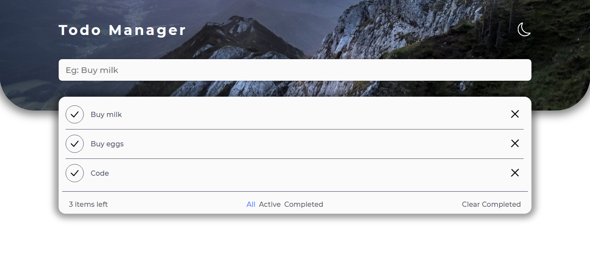
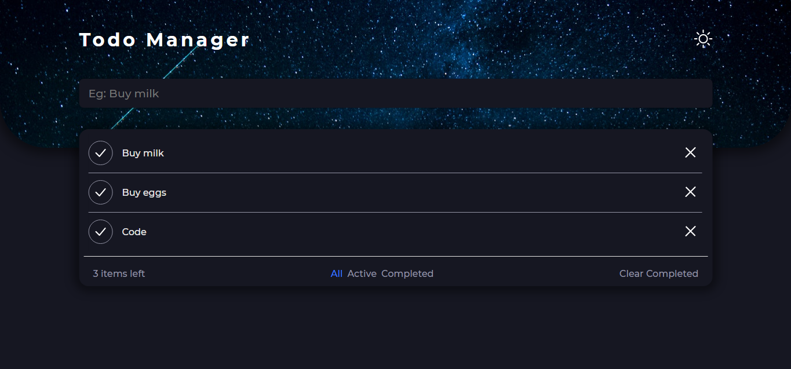

<h1>
  Todo Manager
  
</h1>

## ✉ About

Web application were users can add their tasks, in order to manage what they need to do.

## 👨‍💻 Used technologies

- HTML
- CSS
- JavaScript
- LocalStorage

## 💻 Live application

[Click Here](https://todo-manager-dun.vercel.app/) to go to the live application
